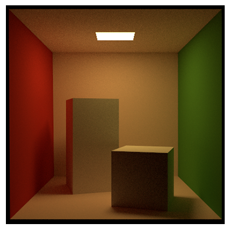

<div align="center">

</div>

<!-- PROJECT LOGO -->
<p align="center">
  <h1 align="center">Transient Mitsuba 3</h1>

  <p align="center">
    <a href="https://mcrespo.me"><strong>Miguel Crespo</strong></a>
    &nbsp;&nbsp;&nbsp;&nbsp;
    <a href="https://diego.contact"><strong>Diego Royo</strong></a>
    &nbsp;&nbsp;&nbsp;&nbsp;
    <a href="https://jgarciapueyo.github.io/"><strong>Jorge García</strong></a>
  </p>

  <!-- <p align="center">
    <a href='' style='padding-left: 0.5rem;'>
      
    </a>
    <a href='' style='padding-left: 0.5rem;'>
      
    </a>
  </p> -->
</p>

<br />

<div align="center">
  
  
  
  
</div>

<br />

# Introduction

This library adds support to [Mitsuba 3](https://github.com/mitsuba-renderer/mitsuba3) for doing transient simulations, and especially non-line-of-sight (NLOS) data capture simulations.

## Quick start:

* [Installation](#installation)
* [Usage](#usage) / [Documentation and examples](https://github.com/diegoroyo/mitsuba3-transient-nlos/tree/main/examples)
* [License and citation](#license)


## What is transient rendering?

Conventional rendering is referred as steady state, where the light propagation speed is assumed to be infinite. In contrast, transient rendering breaks this assumtion allowing to simulate light in motion (see the teaser image for a visual example).

For example, path tracing algorithms integrate over multiple paths that connect a light source with the camera. For a known path, transient path tracing uses the *very complex* formula of `time = distance / speed` (see [[Two New Sciences by Galileo]](https://en.wikipedia.org/wiki/Two_New_Sciences)) to compute the `time` when each photon arrives to the camera from the path's `distance` and light's `speed`. This adds a new `time` dimension to the captured images (i.e. it's a video now). The simulations now take new parameters as input: when to start recording the video, how long is each time step (framerate), and how many frames to record.

*Note: note that the `time` values we need to compute are very small (e.g. light takes only ~3.33 * 10^-9 seconds to travel 1 meter), `time` is usually measured in optical path distance. See [Wikipedia](https://en.wikipedia.org/wiki/Optical_path_length) for more information. TL;DR `opl = distance * refractive_index`*

# Main features

* **Cross-platform:** Mitsuba 3 has been tested on Linux (x86_64), macOS (aarch64, x86_64), and Windows (x86_64).
* **Easy interface** to convert your algorithms for the transient domain.
* **Temporal domain** filtering.
* **Python only** library for doing transient rendering in both CPU and GPU.
* **Several integrators already implemented** including path tracing (also adapted for NLOS scenes) and volumetric path-tracing.

### Roadmap

**Last update: Apr. 2024*

- [ ] Importance sampling of the temporal domain
- [ ] Differentiable transient rendering
- [ ] Fluorescence BRDF
- [X] Non-line-of-sight support (NLOS)
  - [X] `max_depth`
  - [X] `filter_depth`
  - [X] `discard_direct_paths`
  - [ ] `auto_detect_bins`
  - [ ] Faster implementation of exhaustive scanning

# Requirements

- `Python >= 3.8`
- `Mitsuba3 >= 3.5.0`
- (optional) For computation on the GPU: `Nvidia driver >= 495.89`
- (optional) For vectorized / parallel computation on the CPU: `LLVM >= 11.1`


# Installation

We provide the package via PyPI. To install `mitsuba3-transient-nlos` you need to run:

```bash
pip install mitransient
```

If you have installed Mitsuba 3 via `pip` you will only have access to the `llvm_ad_rgb` and `cuda_ad_rgb` variants. If you want to use other variants (e.g. NLOS simulations can greatly benefit from the `llvm_mono` variant), then we recommend that you compile Mitsuba 3 youself, enabling the following variants: `["scalar_mono", "llvm_mono", "llvm_ad_mono", "cuda_mono", "cuda_ad_mono", "scalar_rgb", "llvm_rgb", "llvm_ad_rgb", "cuda_rgb", "cuda_ad_rgb"]`. [Here's more info](https://mitsuba.readthedocs.io/en/latest/src/developer_guide/compiling.html).

## Old installation instructions (incl. Mitsuba 3 fork)

<details>
<summary>See details</summary>
_NOTE: These instructions have been tested on Linux and Windows 11 (Powershell), but can be adapted to MacOS probably (hopefully) without many problems_

After cloning the repo, navigate to the root folder and execute the following commands to build the custom version of Mitsuba 3

*  Step 0: Clone the repo (including the mitsuba3 custom fork submodule)
  ```bash
  git clone git@github.com:diegoroyo/mitsuba3-transient-nlos.git mitsuba3-transient-nlos
  cd mitsuba3-transient-nlos
  git submodule update --init --recursive
  ```

## Now the steps are different for Linux and Windows users

### Linux users:
  * Step 1: Compile mitsuba3 (ext/mitsuba3) from source
    * This is for Linux. for other OSes, check: https://mitsuba.readthedocs.io/en/latest/src/developer_guide/compiling.html
      ```bash
      cd ext/mitsuba3
      mkdir -p build && cd build
      ```
    * You might want to set the C++/C compiler (probably you want this e.g. if `cmake` complains about your version of g++). Always set `C_COMPILER` version to the same version as `CXX_COMPILER` (e.g. if you use `g++-12`, then also set `gcc-12`)
    * If you have multiple Python versions installed, also set Python_EXECUTABLE to ensure that the program is compiled for your specific version of Python
      ```bash
      cmake \
          -GNinja \
          -DCMAKE_CXX_COMPILER=<path-to-c++-compiler> \
          -DCMAKE_C_COMPILER=<path-to-c-compiler> \
          -DPython_EXECUTABLE=<path-to-python-executable> \
          ..
      ```
  
    * Step 1.1: You should see a message that a file was created on "build/mitsuba.conf". Open the file and look for "enabled" variants. Docs: https://mitsuba.readthedocs.io/en/latest/src/key_topics/variants.html
      * Recommended variants: `"scalar_mono", "llvm_mono", "llvm_ad_mono", "cuda_mono", "cuda_ad_mono", "scalar_rgb", "llvm_rgb", "llvm_ad_rgb", "cuda_rgb", "cuda_ad_rgb"`.
      * IMPORTANT: At least one *_ad_* variant needs to be specified.
  
    * Step 1.2: Re-run the cmake command to read the updated mitsuba.conf and compile the code with ninja
      ```bash
      cmake <same arguments as before> ..
      ninja  # This will take some time
      ```
  
  * Step 2: Install `mitsuba3-transient-nlos` (a.k.a. `mitransient` Python library)
    ```bash
    cd ../../..  # go back to initial mitsuba3-transient-nlos folder
    scripts/local_install.sh
    ```

### Windows users:

  * Step 1: Compile mitsuba3 (ext/mitsuba3) from source
    ```powershell
    cd ext/mitsuba3
    ```
    * A recent version of Visual Studio 2022 is required. Cmake need to be installed manually
    * Check that the version of your Python is the correct one when you execute `python`
      ```powershell
      # Specifically ask for the 64 bit version of Visual Studio to be safe
      cmake -G "Visual Studio 17 2022" -A x64 -B build
      ```
  
    * Step 1.1: You should see a message that a file was created on "build/mitsuba.conf". Open the file and look for "enabled" variants. Docs: https://mitsuba.readthedocs.io/en/latest/src/key_topics/variants.html
      * Recommended variants: `"scalar_mono", "llvm_mono", "llvm_ad_mono", "cuda_mono", "cuda_ad_mono", "scalar_rgb", "llvm_rgb", "llvm_ad_rgb", "cuda_rgb", "cuda_ad_rgb"`.
      * IMPORTANT: At least one *_ad_* variant needs to be specified.
  
    * Step 1.2: Re-run the cmake command to read the updated mitsuba.conf and compile the code with Visual Studio. 
      ```powershell
      cmake <same arguments as before>
      # You can build from terminal with this, if you don't like opening Visual Studio
      cmake --build build --config Release  # this will take some time
      ```
  
  * Step 2: Install `mitsuba3-transient-nlos` (a.k.a. `mitransient` Python library)
    * Step 2.1: You will need to edit your environment variables in Windows manually
      ```
      MITSUBA_DIR = <path-to-the-cloned-repository</mitsuba3-transient-nlos/ext/mitsuba3/build/Release
      Path = %Path%;%MITSUBA_DIR%
      PYTHON_PATH = %MITSUBA_DIR%/python
      ```
    * Step 2.2: Install `mitsuba3-transient-nlos` (a.k.a. `mitransient` Python library)
      ```powershell
      cd ../../  # go back to initial mitsuba3-transient-nlos folder
      python -m pip install .
      ```

</details>

## After installation

At this point you should be able to `import mitsuba` and `import mitransient` in your Python code (careful about setting the correct `PATH` environment variable if you have compiled Mitsuba 3 yourself, see the section below).

If it works, you're all set!

For NLOS data capture simulations, see https://github.com/diegoroyo/tal. `tal` is a toolkit that allows you to create and simulate NLOS scenes with an easier shell interface instead of directly from Python.

### If you use your own Mitsuba 3

If you have opted for using a custom (non-default installation through `pip`) of Mitsuba 3, you have several options for it. The idea here is to be able to control which version of Mitsuba will be loaded on demand.

* One solution is to directly execute `setpath.sh` provided after the compilation of the Mitsuba 3 repo [(More info)](https://mitsuba.readthedocs.io/en/latest/src/developer_guide/compiling.html). This shell script (on Linux) will modify the `PATH` and `PYTHONPATH` variables to load first this version of Mitsuba.
* Another solution following the previous one is to directly set yourself the `PYTHONPATH` environment variable as you wish.
* Another solution for having a custom version globally available is by using `pip install .--editable`. This will create a symlink copy of the package files inside the corresponding `site-packages` folder and will be listed as a package installed of `pip` and will be available as other packages installed. If you recompile them, you will still have the newest version directly for use. Please follow these instructions:
  * Go to `<mitsuba-path>/mitsuba3/build/python/drjit` and execute `pip install . --editable`.
  * Go to `<mitsuba-path>/mitsuba3/build/python/mitsuba` and execute `pip install . --editable`.
* If you are a user of Jupyter Notebooks, the easiest solution will be to add the following snippet of code to modify on-site the PYTHON PATH for that specific notebook:
```python
import sys
sys.path.insert(0, '<mitsuba-path>/mitsuba3/build/python')
import mitsuba as mi
```

# Usage

Check out the `examples` folder for practical usage.

As of November 2023, `mitsuba3-transient-nlos` implements the following plugins which can be used in scene XML files. To view a description of their parameters, click on the name of your desired plugin.
* `film`:
  * [`transient_hdr_film`](https://github.com/diegoroyo/mitsuba3-transient-nlos/blob/main/mitransient/films/transient_hdr_film.py): Transient equivalent of Mitsuba 3's `hdrfilm` plugin.
* `integrators`:
  * [`transient_path`](https://github.com/diegoroyo/mitsuba3-transient-nlos/blob/main/mitransient/integrators/transientpath.py): Transient path tracing for line-of-sight scenes. If you want to do NLOS simulations, use `transientnlospath` instead.
  * [`transient_nlos_path`](https://github.com/diegoroyo/mitsuba3-transient-nlos/blob/main/mitransient/integrators/transientnlospath.py): Transient path tracing with specific sampling routines for NLOS scenes (e.g. laser sampling and hidden geometry sampling of the ["Non-Line-of-Sight Transient Rendering" paper](https://diego.contact/publications/nlos-render)).
  * [`transient_prbvolpath`](https://github.com/diegoroyo/mitsuba3-transient-nlos/blob/main/mitransient/integrators/transient_prb_volpath.py): Path Replay Backpropagation for volumetric path tracing. Implemented by Miguel Crespo, untested.
* `sensor`:
  * [`nlos_capture_meter`](https://github.com/diegoroyo/mitsuba3-transient-nlos/blob/main/mitransient/sensors/nloscapturemeter.py): Can be attached to one of the scene's geometries, and measures uniformly-spaced points on such geometry (e.g. relay wall).

## Testing

Our test suite can be ran using `pytest` on the root folder of the repo.

# License and citation

This project was created by [Miguel Crespo](https://mcrespo.me) and expanded by [Diego Royo](https://diego.contact) and [Jorge García](https://jgarciapueyo.github.io/).

If you are using our code for transient NLOS simulations, we would be grateful if you cited [our publication](https://doi.org/10.1016/j.cag.2022.07.003):

```bibtex
@article{royo2022non,
    title = {Non-line-of-sight transient rendering},
    journal = {Computers & Graphics},
    year = {2022},
    issn = {0097-8493},
    doi = {https://doi.org/10.1016/j.cag.2022.07.003},
    url = {https://www.sciencedirect.com/science/article/pii/S0097849322001200},
    author = {Diego Royo and Jorge García and Adolfo Muñoz and Adrian Jarabo}
```

Otherwise you can cite this repository as:

```bibtex
@misc{mitsuba3transient,
  author = {Royo, Diego and Garcia, Jorge and Crespo, Miguel},
  title = {Mitsuba 3 Transient},
  year = {2023},
  publisher = {GitHub},
  journal = {GitHub repository},
  howpublished = {\url{https://github.com/diegoroyo/mitsuba3-transient-nlos}}
}
```
