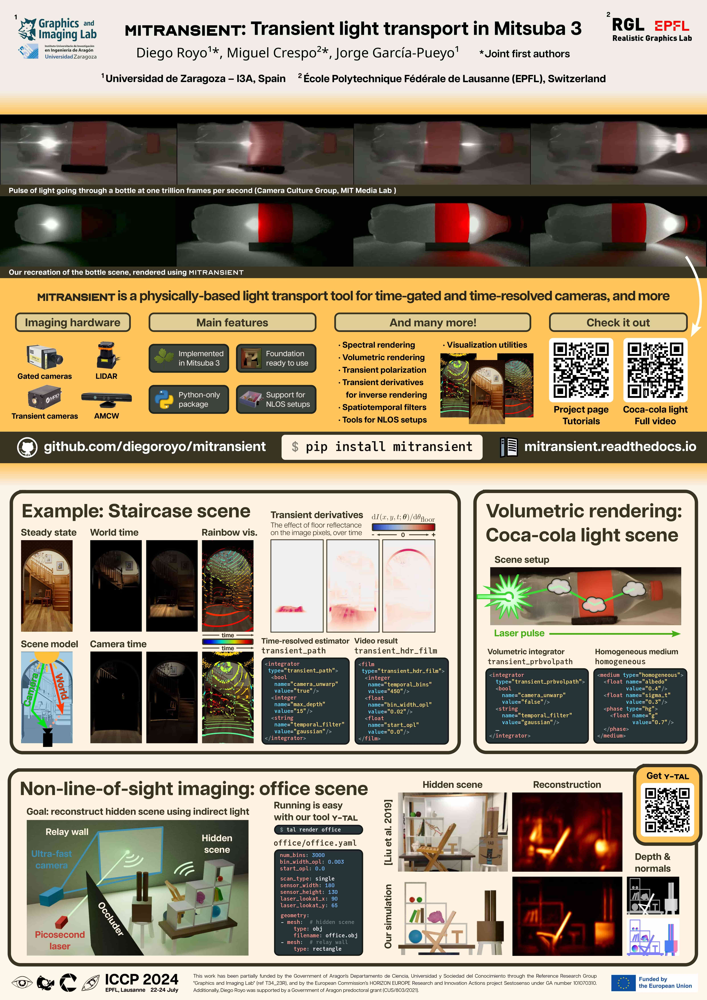

.. image:: ../.images/cornell-box.png
      :width: 23%
.. image:: ../.images/cornell-box.gif
      :width: 23%
.. image:: ../.images/nlos-Z.png
      :width: 23%
.. image:: ../.images/nlos-Z.gif
      :width: 23%

Getting started
===============

``mitransient`` is a library adds support to Mitsuba 3 for doing transient simulations, with amazing support for non-line-of-sight (NLOS) data capture simulations.

Main features
-------------

* **Foundation ready to use:** easy interface to convert your algorithms to the transient domain.
* **Python-only** library for doing transient rendering in both CPU and GPU.
* **Several integrators already implemented:** *transient pathtracing*  (also adapted for NLOS scenes) and *transient volumetric pathtracing*.
* **Cross-platform:** Mitsuba 3 has been tested on Linux (x86_64), macOS (aarch64, x86_64), and Windows (x86_64).
* **Polarization tracking**
* **Differentiable transient rendering**

The following video showcases ``mitransient`` simulating light at a trillion frames per second, `imitating a femto-photography experiment <https://youtu.be/EtsXgODHMWk?t=106>`_.

..  youtube:: wZfS19i6qkA
      :align: center
      :privacy_mode:

Installation
------------

We provide the package via PyPI. Latest release: |pypi-badge|.

.. |pypi-badge| image:: https://img.shields.io/pypi/v/mitransient.svg?color=green
   :target: https://pypi.org/project/mitransient/
   :alt: PyPI version

To install ``mitransient`` you need to run:

.. code-block:: python

      pip install mitransient

which will also install the ``mitsuba`` Python package as a dependency.

**Using your own compiled Mitsuba:** ``mitransient`` and ``mitsuba`` have different *variants* that specify the number of channels (RGB image, monochromatic, etc.), hardware acceleration (execution in CPU, GPU, etc.). If you install ``mitransient``/``mitsuba`` via ``pip``, you will have access to `the following variants specified in this website <https://mitsuba.readthedocs.io/en/stable/src/key_topics/variants.html>`_. There are more variants available, but you will have to compile Mitsuba 3 yourself. For more information on using a custom Mitsuba 3 compilation, see :doc:`src/installation`.

Requirements
~~~~~~~~~~~~

- ``Python >= 3.8``
- ``mitsuba >= 3.6.0``
- (optional) For computation on the GPU: ``Nvidia driver >= 495.89``
- (optional) For vectorized / parallel computation on the CPU: ``LLVM >= 11.1``

Usage
-----

Rendering your first transient scene with ``mitransient`` is easy. The code below will render the famous Cornell Box scene in transient domain and show a video of the results:

.. code-block:: python

      import mitsuba as mi
      mi.set_variant('llvm_ad_rgb')
      import mitransient as mitr

      scene = mi.load_dict(mitr.cornell_box())
      img_steady, img_transient = mi.render(scene, spp=1024)

      img_transient = mitr.vis.tonemap_transient(img_transient)
      mitr.vis.show_video(
      img_transient,
      axis_video=2,
      )

**Important:** ``mitransient`` needs to be imported after ``mitsuba``. The moment you add ``mitransient`` to the code, all of our transient-related plugins are registered in Mitsuba 3. At that point you can call ``mitsuba``'s functions as normal (e.g. ``mi.render`` in the example above), and our additional utility functions (``mitr.cornell_box``, ``mitr.vis.tonemap_transient``, etc.).

Tutorials
~~~~~~~~~

If this is your first time, we strongly recommend that you start with the *Transient rendering* tutorials. Going through these in order will give you an idea of the main features of ``mitransient``. The rest of the tutorials assume that you've gone through :doc:`the first tutorial in that series <src/examples/transient/0-render_cbox_diffuse>`. You can find a full list of all tutorials on the sidebar.

.. grid:: 2

    .. grid-item-card:: Transient rendering
        :class-title: sd-text-center sd-font-weight-bold
        :link: src/tutorials/transient_rendering_tutorials.html

        .. image:: ../.images/cornell-box.png
            :height: 200
            :align: center

    .. grid-item-card:: Non-line-of-sight rendering
        :class-title: sd-text-center sd-font-weight-bold
        :link: src/tutorials/nlos_tutorials.html

        .. image:: ../.images/nlos-Z.png
            :height: 200
            :align: center

.. grid:: 2

    .. grid-item-card:: Transient polarization tracking
        :class-title: sd-text-center sd-font-weight-bold
        :link: src/tutorials/polarization_tutorials.html

        .. image:: ../.images/polarization.png
            :height: 200
            :align: center

    .. grid-item-card:: Differentiable transient rendering
        :class-title: sd-text-center sd-font-weight-bold
        :link: src/tutorials/diff_tutorials.html

        .. image:: ../.images/diff.png
            :height: 200
            :align: center

License and citation
--------------------

This project was started by `Diego Royo <https://diego.contact>`_, `Miguel Crespo <https://mcrespo.me>`_ and `Jorge Garcia-Pueyo <https://jgarciapueyo.github.io/>`_. See the GitHub page for the full list of ``mitransient`` contributors. Also see the `original Mitsuba 3 license and contributors <https://github.com/mitsuba-renderer/mitsuba3>`_.
If you use our code in your project, please consider citing us using the following:

.. code-block:: bibtex

      @misc{mitransient,
            title        = {mitransient},
            author       = {Royo, Diego and Crespo, Miguel and Garcia-Pueyo, Jorge},
            year         = 2024,
            journal      = {GitHub repository},
            doi          = {https://doi.org/10.5281/zenodo.11032518},
            publisher    = {GitHub},
            howpublished = {\url{https://github.com/diegoroyo/mitransient}}
      }

Additionally, the NLOS features were re-implemented from our publication `Non-line-of-sight transient rendering <https://doi.org/10.1016/j.cag.2022.07.003>`_. Please also consider citing us if you use them:

.. code-block:: bibtex

      @article{royo2022non,
            title        = {Non-line-of-sight transient rendering},
            author       = {Diego Royo and Jorge García and Adolfo Muñoz and Adrian Jarabo},
            year         = 2022,
            journal      = {Computers & Graphics},
            doi          = {https://doi.org/10.1016/j.cag.2022.07.003},
            issn         = {0097-8493},
            url          = {https://www.sciencedirect.com/science/article/pii/S0097849322001200}
      }

What is transient rendering?
----------------------------

Conventional rendering is referred to as steady state, where the light propagation speed is assumed to be infinite. In contrast, transient rendering breaks this assumption allowing us to simulate light in motion (see the teaser image for a visual example).

For example, path tracing algorithms integrate over multiple paths that connect a light source with the camera. For a known path, transient path tracing uses the very complex formula of time = distance / speed (see [Two New Sciences by Galileo]) to compute the time when each photon arrives at the camera from the path's distance and light's speed. This adds a new time dimension to the captured images (i.e. it's a video now). The simulations now take new parameters as input: when to start recording the video, how long is each time step (framerate), and how many frames to record.

Note: note that the time values we need to compute are very small (e.g. light takes only ~3.33 * 10^-9 seconds to travel 1 meter), time is usually measured in optical path distance. See Wikipedia for more information. TL;DR opl = distance * refractive_index

.. .....................................................
.. toctree::
      :hidden:
      
      self
      src/installation

.. toctree::
      :maxdepth: 1
      :caption: Tutorials
      :hidden:
      
      src/tutorials/transient_rendering_tutorials
      src/tutorials/nlos_tutorials
      src/tutorials/polarization_tutorials
      src/tutorials/diff_tutorials
      src/tutorials/angulararea_tutorials

.. toctree::
      :maxdepth: 1
      :caption: API reference
      :hidden:

      src/other

.. toctree::
      :maxdepth: 1
      :caption: Pulgin reference
      :hidden:

      generated/plugin_reference/section_emitters
      generated/plugin_reference/section_films
      generated/plugin_reference/section_integrators
      generated/plugin_reference/section_sensors